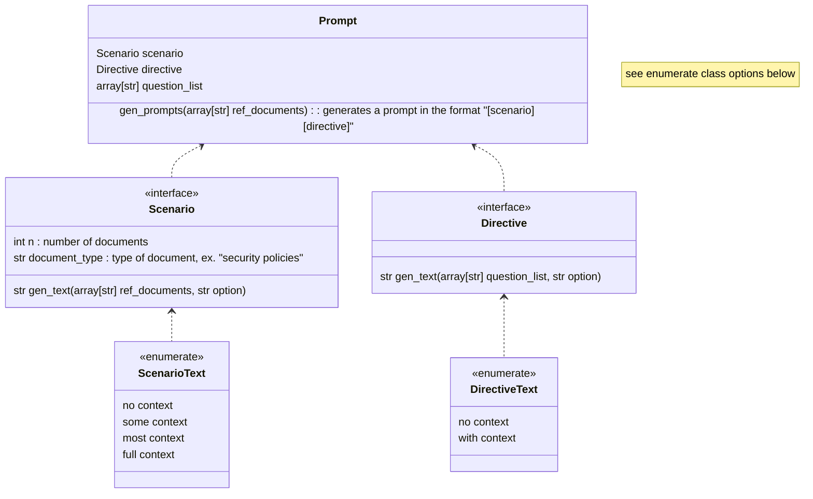

# Notes
---
* All prompts will ask the same thing. the difference is going to be in how the questions are formulated.
* everything will be asked for at the same time
* asking questions first feels unnatural. more focus should be given to providing the scenario first

# Data Table Outline
---
| Model | Question | Role | Method | Factuality | Reasonableness |
| ----- | -------- | ---- |---------- | ------------- | ---------------------- |
| ChatGPT | Question $j$ | | | | |
| Model $i$ | Question $j$ | | | |
| Model ... | Question $j$ | | | |
| Model $m$ | Question $j$ | | | | 
|||||| 
| ChatGPT | Question ... | | | |
| Model $i$ | Question ... | | | |  
| Model ... | Question ... | | | |  
| Model $m$ | Question ... | | | |  
|||||| 
| ChatGPT | Question $n$ | | | | | 
| Model $i$ | Question $n$ | | | |  
| Model ... | Question $n$ | | | |  
| Model $m$ | Question $n$ | | | |  

---
# question_list contents
---
#### Used
* what are any similarities in how each company uses my data.
* are there any differences in how each company uses my data.
* which third party entities are mentioned in both policies.
* what are the third parties that are only mentioned in one of the given policies.
* what kind of data is collected by both policies.
* what kind of data is exclusively collected by each policy.
* what kind of data is protected by both policies.
* what kind of data is exclusively protected by each policy.

#### Unused
* which policy is more ethical / What makes either policy more ethical than the other
* most useful information/Most important details of the policy
* what are the main policy differences.
* what are the similarities between both policies.

### Scenario Text Options
| Style | Text |
| - | - |
| No Context | "document 1: $\text{\texttt{ref\_documents[0]}}$, document 2: $\text{\texttt{ref\_documents[1]}}$, $\ldots$"
| Some Context | "I have $n$ $\text{\texttt{[document\_type]}}$ documents that I would like you to look at. The first document is $\text{\texttt{ref\_documents[0]}}$. The second ..." |
| Most Context | "I have been given $n$ $\text{\texttt{[document\_type(s)]}}$. These $\text{\texttt{[document\_type(s)]}}$ are used to disclose how certain companies collect data and how it is shared. Here are the documents I've been given..." |
| Full Context | "I have been given $n$ $\text{\texttt{[document\_type(s)]}}$. These $\text{\texttt{[document\_type(s)]}}$ are used to disclose how certain companies collect data and how it is shared. $\text{\texttt{[specify formatting]}}$. Here are the documents I've been given..." |

### Directive Text Options
| Style | Text |
| - | - | 
| No Context | "$\text{\texttt{question\_list[0]}}$, $\text{\texttt{question\_list[1]}}$, $\ldots$"  |
| With Context | "based off of the previously given documents please answer the following questions: 1) $\text{\texttt{question\_list[0]}}$,  2) ..." |

